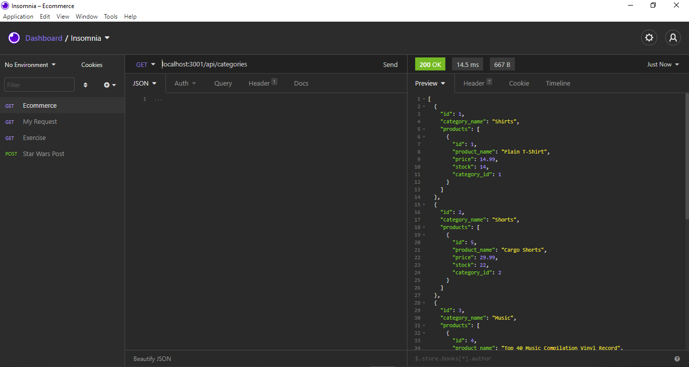
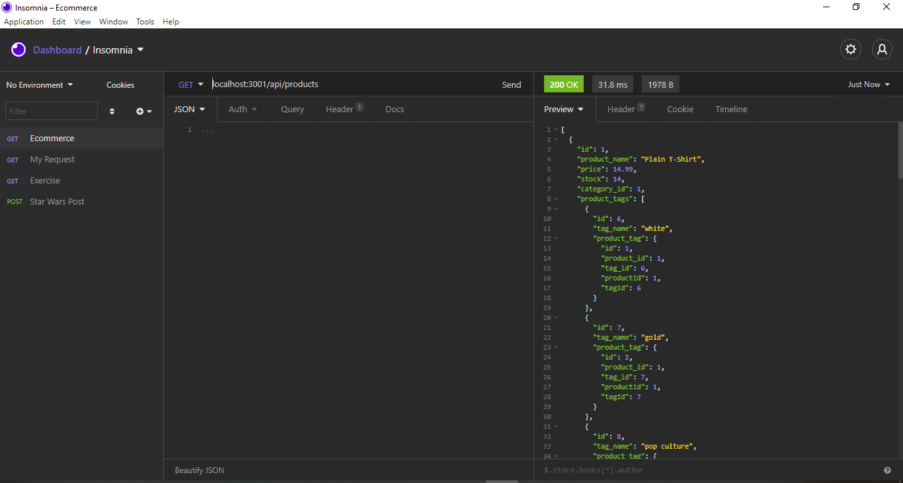
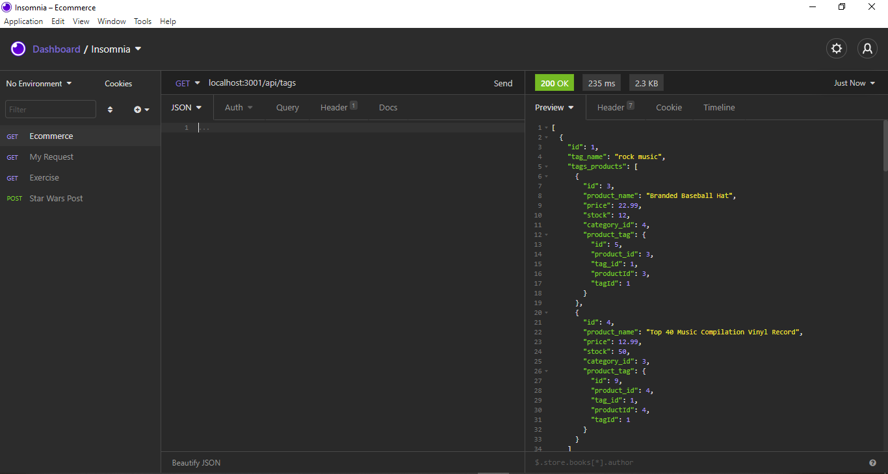

# E-CommerceBackEnd

## Table of contents
  * [Description](#Description)
  * [Technologies](#Technologies)
  * [Installation](#Installation)
  * [Usage](#Usage)
  * [Contributing](#Contributing)
  * [Test](#Test)
  * [Questions](#Questions)
  * [Credits](#Credits)
  * [License](#License)

  ## Description
 The following project allows a manager at an internet company to use the latest techologies in the back end of its application 

  ##  Technologies
  * MySql
  * Sequelize
  * Express.js

  ## Installation
  * Create a repo on GitHub
  * Clone the repo into your desire folder
  * Do the configuration and the server
  * Have a database connected with MySQL
  * Write the models
  * Have a seed file for each model
  * Write the api routes
  * Run npm install, npm run seed, npm start
  * Commit changes

  ## Usage
  It is useful for a manager of an ecommerce to have a robust back end website that can compete with other e-commerce companies. 

  ## Test
  Link to the demo: 
  
  
  
  

  ## Questions
  For further questions please contact the author

  ## Credits
  Sofia Rojas sofiacrf@github.com

  ## Link to github repo
 https://github.com/Sofiacrf/E-CommerceBackEnd.git
  